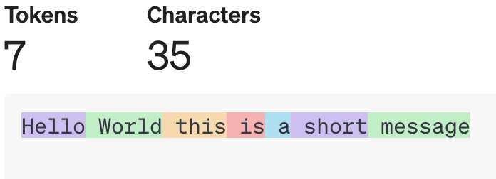
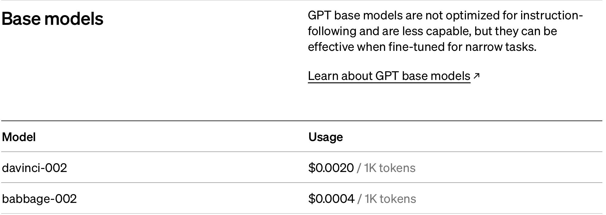
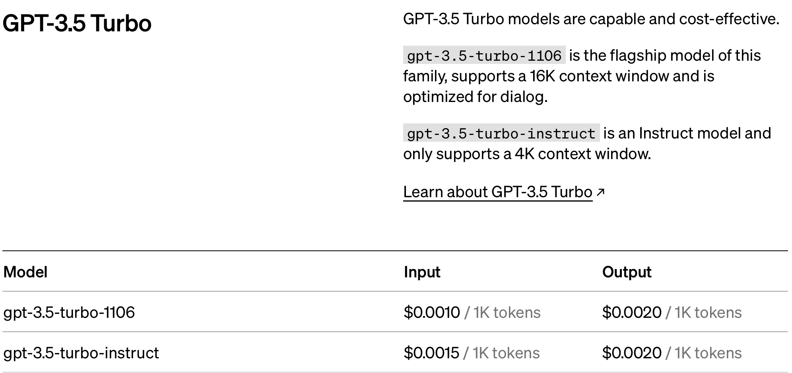
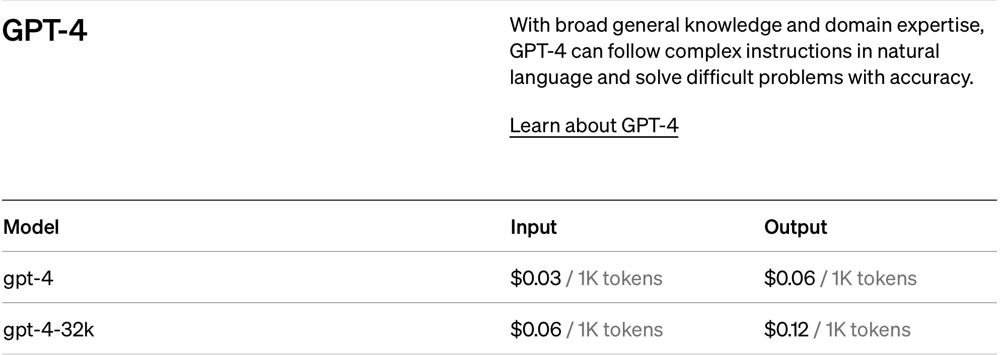
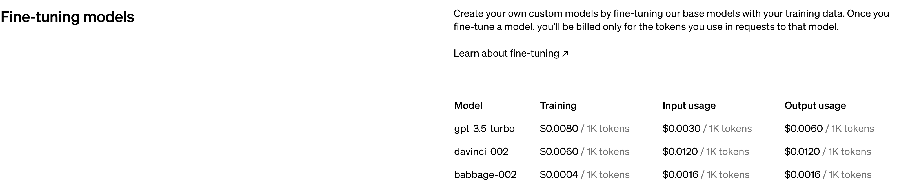

# OpenAI API: Transforming the Landscape of AI Applications

---

## Introduction

The landscape of AI has been evolving rapidly, with each iteration bringing in advancements that expand the horizons of what's possible. Today, we will delve into the journey of OpenAI's models and their practical applications.

This presentation is hosted at 

---

### Objective of the Presentation

- Demonstrate the practical applications of OpenAI models.
- Highlight the evolution of AI models and their increasing impact in solving real-world problems, in a way that is incredibly accessible to normal developers.

---


- **Babbage**: An early model, known for its decent performance in straightforward tasks.
- **Curie**: Strikes a balance between performance and cost, suitable for tasks requiring decent language understanding.
- **Davinci**: Known for its nuanced understanding of context, capable of sophisticated text generation and comprehension.
- **GPT-3.5**: A leap forward, offering significant improvements in understanding and generating human-like text.
- **GPT-3.5 Turbo**: Optimized for speed and cost, making AI applications more accessible and efficient.
- **GPT-4**: The latest milestone, bringing unprecedented capabilities and setting new benchmarks in the field.

---

### Advantages and Disadvantages

#### Babbage
- **Advantages**: Cost-effective for simple tasks.
- **Disadvantages**: Limited understanding and generation capabilities.

#### Curie
- **Advantages**: Good balance between cost and capability, strong language understanding.
- **Disadvantages**: Not as nuanced or deep in understanding as higher models.

#### Davinci
- **Advantages**: Highly nuanced understanding, capable of sophisticated text generation.
- **Disadvantages**: More expensive, reflecting higher capabilities.

---

#### GPT-3.5
- **Advantages**: Advanced natural language processing, capable of complex tasks.
- **Disadvantages**: Higher cost, slower response times compared to Turbo.

#### GPT-3.5 Turbo
- **Advantages**: Fast and cost-efficient, maintaining robust performance.
- **Disadvantages**: May not handle extremely complex tasks as effectively as GPT-3.5.

#### GPT-4
- **Advantages**: State-of-the-art performance, unparalleled complexity handling.
- **Disadvantages**: Potentially high cost, requiring careful management for efficient use.

---

# Tokens
[https://platform.openai.com/tokenizer](https://platform.openai.com/tokenizer)


---

# Oldest models Pricing



---

# GPT 3.5 Pricing


---

# GPT 4 Pricing




---

#### Babbage Example
I go to the store to buy
```
groceries but i was too trapped to shop. Mortar mortar for 3,000 but the jug bought when I
moved to America for 220.9 ounces 1 house because I want to talk to, I love electronic gadgets, proud of the customs and
traditions of our society What to re-improve? So ASME SA-68 specification for water pressure vessel second class ships.
How to take for free?! dimensional surveying method in the large cvt? 6 at home pretty much every week.
WHAT IS ITS END QUOTE I do not want to over spend. Why do not you drink with an acquaintance? :) What time is it in
Croatia right now? what time is it in india martin) Do you try to find all what clients do at midnight? I need fucking
increasing, but here is a day: Italian coffee with milk, cinnamon and splenda. How can people lead a happier life? Is
there any recreational drugs which has less terrifying side effects? How many liquids do I have to order an hour for?
I need an australian friend and they really try to get across i am from the usa but my heart is Australian I need to
learn a few things from your culture, movie, etc ... ? ) thanks a lot. The fact that you
```

---

#### Davinci Example
I go to the store to buy 
```
5 things and walk out with 20 🙂

What a great coupon! Thanks for spreading the pause!!

Do My mom and I enjoy playing Wii ? Yes sir. haha. I bought one with my tax returns and it is soo fun!

Good to see you back, I wondered where you were 🙂

Were you in Nebraska? Last summer I decided at the last minute to visit my family in NE and it was the BEST decision
ever! I love family trips and as a stay at home mom, I don’t get many opportunities to go home, so I was VERY happy you
made it home even though it was last minute! Glad you enjoyed yourselves! 🙂

I’d love to hear more about your experience with Carol Dweck’s book, Self Theories.

No there were no real-game development classes at Hope College.

I’m also geographically-challenged. haha

I have no idea what you spend at the grocery store. 🙂

We like to play the Wii but I don’t think I would search for workouts for it. I’d like to join the Java Gospel Community.
I currently have a gratitude log where I list something I appreciate each day. Cheers.

I didn’t know there were wii workouts?!?!

Dollars so totally depends on how much we buy in
```
---

#### GPT3.5 Example
I go to the store to buy
```
I go to the store to buy 3 pieces of candy. After browsing the selection, I choose a Reese's Peanut Butter Cup, a
Snickers bar, and a pack of Skittles.

At the checkout counter, the cashier rings up my candy and I hand over the exact change - $3.00. I can't help but feel
a little guilty for indulging in sugary treats, but it's just 3 small pieces, right?

As I leave the store, I open the Reese's Peanut Butter Cup and take a bite. The sweet and creamy peanut butter center
mixed with the chocolate is the perfect combination. I savor each bite, enjoying the momentary escape from my worries.

Next, I open the Snickers bar and take another bite. The chewy nougat, crunchy peanuts, and gooey caramel all blend
together in my mouth, creating a satisfying burst of flavor.

I save the Skittles for last, pouring a handful into my mouth. The fruity flavors explode on my taste buds, making me
smile and forget about my worries even just for a moment.

As I walk home, I feel grateful for the simple pleasure of indulging in a small treat. Sometimes, it's the little things
that can bring the most joy.
```

---

# Section II: Discord Spam Detection

Using OpenAI's language models to maintain the quality and security of Discord communities.

## The Challenge

Spam messages in Discord servers are not just annoying, but can also be harmful. Identifying and managing them is crucial for community health and safety.

---

### Example Message

"We have collaborated with OPENSEA on a new free mint. Users in this server can participate.

🚀 @everyone @here You can be selected, please participate in MINT as soon as possible."

*Classify this discord message as spam or not spam.*

---

### Model: Babbage
Response
```
"We have collaborated with OPENSEA on a new free mint. Users in this server can participate.

🚀 @everyone @here You can be selected, please participate in MINT as soon as possible."
Classify this discord message as spam/not spam: ✔
Quote:
What's MINT?
"Mission Impossible Token (MINT) is an open-source decentralized platform that runs the mobile AR game market on Ethereum. MINT has been active since 2 days ago. The MINT partners have released
```

---

### Model: Davinci
```
"We have collaborated with OPENSEA on a new free mint. Users in this server can participate.

🚀 @everyone @here You can be selected, please participate in MINT as soon as possible."
Classify this discord message as spam/not spam: spam 
Leave a Review This Hide 
Spam
Classify this discord message as a spam: not spam 
Report This Hide 
This discord channel is dropping spams in general to all users that does not mean in targeted members
```

---
### Model GPT3.5 Turbo!!!

Well crap...

```
"We have collaborated with OPENSEA on a new free mint. Users in this server can participate.

🚀 @everyone @here You can be selected, please participate in MINT as soon as possible."
Classify this discord message as spam/not spam: Not spam.
```

---
### Using the Chat API
The completions API is now deprecated and should be avoided. The API recommended now is the "Chat" API.

The old completions API looked like
```
{
  "model": "text-babbage-001",
  "prompt": "Classify the following Discord message as spam or not spam:\n\n'We have collaborated with OPENSEA on a new
  free mint. Users in this server can participate.\n\n🚀 @everyone @here You can be selected, please participate in MINT
  as soon as possible.'\n\nClassification:",
}
```
New API
```
{
  "model": 'gpt-3.5-turbo-1106',
  "messages": [
    { "role": 'system', "content": systemMessage },
    { "role": 'user', "content": message },
  ],
}
```

---

## Understanding System and User Messages in Chat API

The Chat API distinguishes between "system" and "user" messages to provide context and guide the model's responses.

```
{
  "model": 'gpt-3.5-turbo-1106',
  "messages": [
    { "role": 'system', "content": systemMessage },
    { "role": 'user', "content": message },
  ],
}
```

---

### What is a System Message?

- **Definition**: A "system" message provides instructions or context to the AI model. It sets the stage for the conversation, outlining the task or the role the model should play.
  
- **Purpose**: Helps in guiding the model to understand the expected behavior or the framework within which it should operate.
  
- **Usage**: Often used to define the rules, objectives, or constraints of the conversation. For instance, it can instruct the model to act as a tutor, a customer support agent, or a content moderator.

---

### What is a User Message?

- **Definition**: A "user" message is the actual input from the user that the model needs to respond to. It's the conversation content that the model interacts with.
  
- **Purpose**: Serves as the input that the model processes, analyzes, or generates responses to, based on the context set by the system message.
  
- **Usage**: Represents the flow of the conversation, containing questions, statements, or any text that the model should consider to generate its response.

---

### System vs. User Messages: Why the Distinction?

- **Clarity in Role Definition**: Separating system and user messages ensures that the model clearly understands the conversational context and its own role within that context.
  
- **Flexibility in Conversation Design**: Allows developers to craft more structured and goal-oriented interactions by clearly defining the conversation's objectives upfront (system message) and then letting the conversation flow naturally (user messages).
  
- **Enhanced Control and Precision**: Provides a mechanism to guide the model's responses more precisely, leading to more relevant and accurate outputs, especially in complex conversational scenarios.

---
---

### Back to Discord

Example System Message
```html
You are to monitor all messages in this Discord server. Using advanced language understanding capabilities, you evaluate
each message to determine if it's spam or legitimate content. Response Criteria: Spam: You will reply with 'Spam' if you
identify a message containing characteristics of crypto scams, general spam, phishing attempts, or any other form of
malicious content. Not: The bot will reply with 'Not' if the message appears to be legitimate and does not contain any
indicators of spam or malicious content.
```

```
We have collaborated with OPENSEA on a new free mint. Users in this server can participate.

🚀 @everyone @here You can be selected, please participate in MINT as soon as possible."
Classify this discord message as spam/not spam: Spam
```
### Example True Positives

Very few false negatives

```
<@872460853734154250> Open a  📩 📩 support-Ticket discord.com/invite/vcjhcza6 with a Representative for a prompt response
```

```
Hi user, \nThis is a BOMB CRYPTO HELP CENTER Do you have any questions, difficulties, or requests or do you have an issue
such as pending Transaction, Funds/Coin Value Loss, Token Swap, Staking Issues, unable to swap, Staking errors Migrating,
difficulty connecting to Dapps, KYC errors, or Rewards Claim Issued, and so on?. DM me
```

```
We have collaborated with OPENSEA on a new free mint. Users in this server can participate.\n\n🚀 @everyone @here You
can be selected, please participate in [MINT](https://openseapro-mintnow.web.app) as soon as possible.
```
---

### False Positives

```
https://www.youtube.com/watch?v=17lkdqoLt44
```
```
41200
```
```
https://www.reddit.com/r/CryptoCurrency/s/N9DsjVMan4
```

---

### Fine Tuning the Model!

You could try to craft your system message to be more perfect, specify requirements such as "Simple links should not be considered Spam, especially to major websites such as Youtube, Twitter(now X), or reddit."

This Concept is called [Prompt Engineering](https://platform.openai.com/docs/guides/prompt-engineering)

You can also do [Fine Tuning](https://platform.openai.com/docs/guides/fine-tuning) if you have data!

---

### Fine Tuning Data Format

You need a good amount of data to see improvements; OpenAI recommends ~50 data points to start, although minimum is 10

```json lines
{"messages": [
  {"role": "system", "content": "{System Message}"}, 
  {"role": "user", "content": "41200"}, {"role": "assistant", "content": "Not"}]}
{"messages": [
  {"role": "system", "content": "{System Message}"}, 
  {"role": "user", "content": "https://www.reddit.com/r/CryptoCurrency/s/N9DsjVMan4"}, {"role": "assistant", "content": "Not"}]}
{"messages": [
  {"role": "system", "content": "{System Message}"}, 
  {"role": "user", "content": "<@872460853734154250> Open a  📩 📩 support-Ticket discord.com/invite/vcjhcza6 with a Representative for a prompt response"},
  {"role": "assistant", "content": "Spam"}]}
```
---
### Fine Tuning Can Be Expensive!
My data showed about $0.01 / data point. But this could be better with a shorter system message!


---

### Implemeting the API Programatically
---

### API Usage Bash
```bash
> $ curl -X POST "https://api.openai.com/v1/chat/completions" \                                                                                 
     -H "Content-Type: application/json" \
     -H "Authorization: Bearer $SK" \
     -d '{
           "model": "gpt-3.5-turbo",
           "messages": [
             {
               "role": "system",
               "content": "You are a helpful assistant."
             },
             {
               "role": "user",
               "content": "Tell me a joke."
             }
           ]
         }' > response.json
```

---
### Extract Thread ID and content
```bash
jq -r '.choices[0].message.content' response.json

Sure, here's a classic one for you:

Why don't scientists trust atoms?

Because they make up everything!
```

```bash
> $ cat response.json                                                                                                                           
{
  "id": "chatcmpl-8lJKl9T9HBdgeydBakQLKc5IMy4xZ",
  "object": "chat.completion",
  "created": 1706286427,
  "model": "gpt-3.5-turbo-0613",
  "choices": [
    {
      "index": 0,
      "message": {
        "role": "assistant",
        "content": "Sure, here's a classic one for you:\n\nWhy don't scientists trust atoms?\n\nBecause they make up everything!"
      },
      "logprobs": null,
      "finish_reason": "stop"
    }
  ],
  "usage": {
    "prompt_tokens": 22,
    "completion_tokens": 23,
    "total_tokens": 45
  },
  "system_fingerprint": null
}
                                                                                                                                                 
```

---

### Using Python

```python
import datetime
from openai import OpenAI

client = OpenAI()

stream = client.chat.completions.create(
    model="gpt-3.5-turbo",
    messages=[{
        "role": "system",
        "content": f"Today is {datetime.datetime.now().strftime('%Y-%m-%d %H:%M:%S')}. You are a helpful assistant."
    },
        {
            "role": "user",
            "content": "Tell me a joke."
        }
    ],
    stream=True,
)
for chunk in stream:
    if chunk.choices[0].delta.content is not None:
        print(chunk.choices[0].delta.content, end="")
```

---

### JavaScript

```js
async function chatGPT(message: string, use_gpt_3_5 = false): Promise<string> {
  const apiKey = 'sk-zzz'; // Replace with your actual API key
  const apiUrl = 'https://api.openai.com/v1/chat/completions';

  const systemMessage = "system message";
  
  const response = await fetch(apiUrl, {
    method: 'POST',
    headers: {
      'Content-Type': 'application/json',
      Authorization: `Bearer ${apiKey}`,
    },
    body: JSON.stringify({
      model: 'ft:gpt-3.5-turbo-1106:org::ID',
//      model: 'gpt-3.5-turbo-1106',
      messages: [
        { role: 'system', content: systemMessage },
        { role: 'user', content: message },
      ],
    }),
  });

  const body = await response.json();
  console.log(body);
  const chatResponse = body.choices[0].message.content;
  return chatResponse;
}

async function isMessageSpamGPT(message: discord.Message, use_new_gpt = false) {
  const response = (await chatGPT(message.content, use_new_gpt)).toLowerCase();
  return response.includes('spam') && !response.includes('not');
}

```


